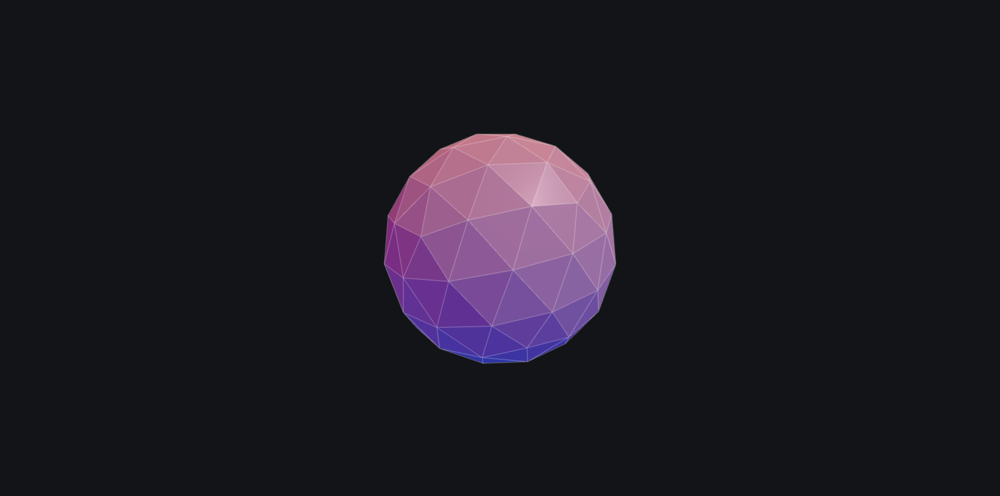

# cude-3d 🌐

[](https://threejs.org/)
[](https://vitejs.dev/)
[](https://developer.mozilla.org/en-US/docs/Web/JavaScript)
[](LICENSE)

An interactive, modular 3D geometry showcase built with **Three.js** and bundled with **Vite**. Features a faceted icosahedron with an overlay wireframe shell, dynamic dual-tone lighting, and smooth orbit camera controls.



---

## ✨ Features

- **Modular Architecture**: Clean Separation of Concerns with dedicated modules for geometry, lighting, controls, and styles.
- **Dual-Layer 3D Geometry**: Flat-shaded faceted `IcosahedronGeometry` coupled with a scaled wireframe outer lattice.
- **Dynamic Dual-Tone Lighting**: Sky/ground hemisphere light (vibrant red & blue tone) paired with directional illumination for sharp specular contrast.
- **Smooth Orbit Controls**: Interactive mouse and touch navigation with inertia damping (`enableDamping: true`) and zoom clamping.
- **Frame-Rate Independent**: Animation loop driven by `THREE.Clock` delta time for uniform rotation across all display refresh rates (60Hz, 120Hz, 144Hz+).
- **Responsive Viewport**: Automatic window resize handler that updates camera projection matrix, renderer dimensions, and caps Retina pixel ratios to 2.
- **WebGL2 Graceful Degradation**: Built-in capability check with user-friendly fallback messaging.
- **Vite Powered**: Lightning-fast hot module replacement (HMR) in development and highly optimized production builds.

---

## 📁 Project Structure

```text
cude-3d/
├── components/
│   ├── controls.js       # OrbitControls initialization and damping setup
│   ├── lights.js         # Scene lighting (Hemisphere & Directional lights)
│   └── mesh.js           # 3D geometry and dual-material mesh creation
├── public/
│   └── favicon.svg       # Application SVG favicon
├── .gitignore            # Git ignore rules for node_modules, dist, etc.
├── home.png              # Showcase preview screenshot
├── index.html            # Entry HTML file
├── main.js               # Application bootstrap, WebGL check & animation loop
├── package.json          # Project scripts and dependencies
├── style.css             # Fullscreen canvas resets and layout styles
├── vite.config.js        # Vite configuration (server port & build targets)
└── README.md             # Project documentation
```

---

## 🚀 Getting Started

### Prerequisites

Ensure you have **Node.js** (v18.0.0 or higher recommended) and **npm** installed:

```bash
node -v
npm -v
```

### Installation

1. Clone or open the repository:
   ```bash
   cd cude-3d
   ```

2. Install the project dependencies:
   ```bash
   npm install
   ```

---

## 💻 Available Scripts

| Command | Description |
| :--- | :--- |
| `npm run dev` | Starts the Vite local development server (with HMR) at `http://localhost:3000` |
| `npm run build` | Compiles and bundles production-ready assets into the `dist/` folder |
| `npm run preview` | Locally previews the production build created in `dist/` |

### Running the Development Server

```bash
npm run dev
```

Open your browser and navigate to `http://localhost:3000` to view the 3D scene.

### Building for Production

```bash
npm run build
```

---

## 🎮 Interactive Controls

| Input | Action |
| :--- | :--- |
| **Left Click + Drag** (or Single-finger swipe) | Rotate / Orbit camera around the 3D model |
| **Right Click + Drag** (or Two-finger swipe) | Pan camera across the viewport |
| **Mouse Wheel Scroll** (or Pinch to zoom) | Zoom in and out (clamped between 1.5 and 10 units) |

---

## 🛠️ Customization

- **Change Geometry / Material**: Edit [`components/mesh.js`](file:///home/mohnasr/Desktop/old/MP/Three/cube3D/components/mesh.js) to adjust the shape (e.g. `TorusKnotGeometry`, `BoxGeometry`), colors, metalness, roughness, or wireframe opacity.
- **Adjust Lighting**: Modify [`components/lights.js`](file:///home/mohnasr/Desktop/old/MP/Three/cube3D/components/lights.js) to tweak light colors, intensity, or positions.
- **Tweak Camera & Controls**: Customize zoom limits, damping factor, or initial camera position in [`components/controls.js`](file:///home/mohnasr/Desktop/old/MP/Three/cube3D/components/controls.js) and [`main.js`](file:///home/mohnasr/Desktop/old/MP/Three/cube3D/main.js).

---

## 📦 Dependencies

- **[Three.js](https://threejs.org/)** (`^0.168.0`) - Modern WebGL 3D graphics library.
- **[Vite](https://vitejs.dev/)** (`^5.4.1`) - Next-generation frontend tooling and bundler.

---

## 📄 License

This project is open source and available under the [MIT License](LICENSE).
